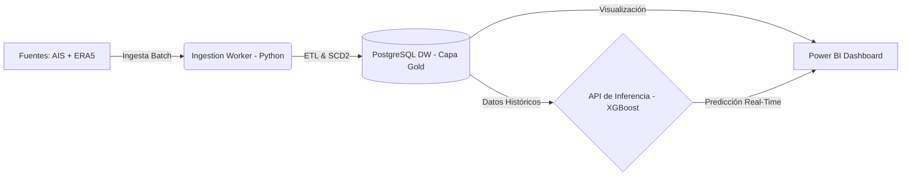

# **🧭 NavOptima: Plataforma de Ingeniería de Datos para Eficiencia de Combustible**


## Copyright & License / Licencia y Derechos de Autor

**Copyright (c) [2026]. All Rights Reserved.**

### English
This project is proprietary and confidential. Unauthorized copying, distribution, modification, or use of this source code or any associated files, via any medium, is strictly prohibited. 

This repository is for portfolio/demonstration purposes only. No license is granted to use this software.

---

### Español
**Copyright (c) [2026]. Todos los derechos reservados.**

Este proyecto es propietario y confidencial. Queda estrictamente prohibida la copia, distribución, modificación o uso no autorizado de este código fuente o cualquiera de sus archivos asociados, por cualquier medio.

Este repositorio es únicamente con fines de demostración o portafolio. No se otorga ninguna licencia para usar este software.

---

## **📝 Resumen del Proyecto**

**NavOptima** es una plataforma de inteligencia operativa diseñada para procesar telemetría marítima y variables climáticas con el fin de optimizar el costo de combustible.

El sistema implementa una arquitectura **Lakehouse** completa sobre microservicios. Transforma datos crudos de posicionamiento (AIS) y meteorología (ERA5) en insights financieros y predicciones de consumo auditables, permitiendo monitorear la eficiencia de la flota mediante un "Gemelo Digital" validado físicamente.

## **🏗️ Arquitectura del Sistema (v1.0)**

El proyecto ha evolucionado a una arquitectura contenerizada orquestada por Docker Compose, siguiendo el patrón **Medallion Architecture**.



### Microservicios Desplegados

| Servicio | Contenedor | Puerto | Función |
| --- | --- | --- | --- |
| **Data Warehouse** | `navoptima_db` | `5432` | Base de datos PostgreSQL con esquema **3FN/Estrella**. Maneja historia de activos (SCD Tipo 2). |
| **ETL Worker** | `navoptima_worker` | N/A | Motor de procesamiento Python. Ejecuta limpieza, fusión climática y carga masiva. |
| **Inference API** | `navoptima_api` | `8000` | Servicio FastAPI que expone el modelo XGBoost para predicciones en tiempo real. |

## **🚀 Guía de Inicio Rápido (Getting Started)**

### 1. Requisitos Previos

* Docker Desktop & Docker Compose.
* Power BI Desktop (para visualización).
* Git.

### 2. Despliegue de Infraestructura

Levantar toda la plataforma con un solo comando desde la carpeta del proyecto:

```bash
cd orchestration
docker compose up -d --build

```

### 3. Ingesta de Datos (Poblado Inicial)

Una vez activos los contenedores, ejecutar el script de carga para llenar el Data Warehouse con los datos procesados:

```bash
docker exec -it navoptima_worker python src/data_processor/loader.py

```

### 4. Uso de la API de Predicción

La API estará disponible localmente.

* **Swagger UI:** `http://localhost:8000/docs`
* **Endpoint:** `POST /predict`

## **📊 Modelo de Datos (Capa Gold)**

Diseñado para soportar auditoría financiera y ML:

* **`fact_vessel_performance`**: Tabla central de hechos. Métricas físicas (velocidad, calado) y financieras.
* **`dim_vessels`**: Dimensión con **SCD Tipo 2** (History Tracking) para trazabilidad de cambios en la flota.
* **`dim_weather_metrics`**: Catálogo normalizado de condiciones ambientales.
* **`dim_vessel_types`**: Maestro de tipos normalizado (3FN).

## **🧠 Inteligencia Artificial (MLOps)**

El núcleo es un modelo **XGBoost Regressor** (`xgb_navoptima_v1.json`).

* **Entrenamiento:** Pipeline automático en `src/ml_engine/training`.
* **Features:** Velocidad (), Calado, Eslora, Viento (), Olas ().
* **Métricas (Test Set):**
* ** Score:** ~97%
* **RMSE:** ~2.73 kg/h


## **📂 Estructura del Proyecto**

```text
navoptima/
├── data/               # Data Lake (Raw, Processed)
├── docs/               # Documentación (ADR, DDL, Diseño)
├── models/             # Artefactos Binarios (.json, .pkl)
├── notebooks/          # Laboratorio de Data Science
├── orchestration/      # Docker Compose & Dockerfiles
├── reports/            # Reportes de Resultados
├── src/                # Código Fuente Modular
│   ├── data_processor  # Lógica ETL (Loader)
│   ├── ml_engine       # API (Serving) y Training
│   └── ingestion_worker # Estrategias de Ingesta
└── README.md           # Esta documentación

```